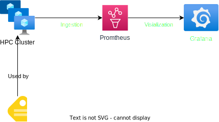

# Warning
Use at your own risk responsibility etc.  For POC purposes only, designed for functionality, not security.  Im not giving support, nor does my employer, unless I'm actualy on your project.  HPC can be expensive.  Watch your bill.
# What does this do? 
Adds a monitoring part to the Cyclecloud Demo.  

# Known issue's
- Not anymore :)

# Architecture overview
