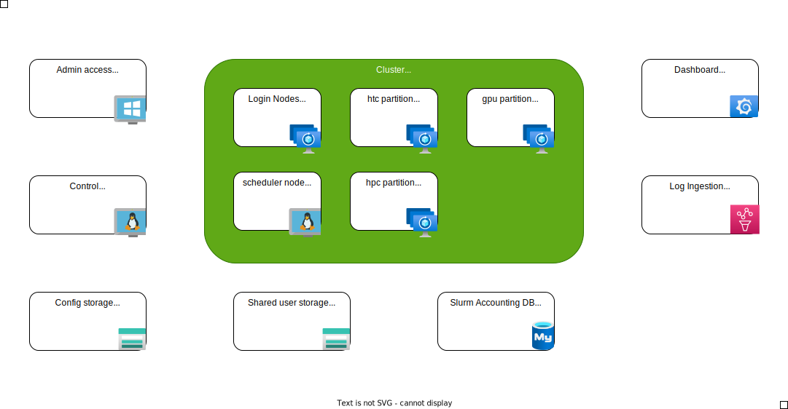

# Warning
Use at your own risk responsibility etc.  For POC purposes only, designed for functionality, not security.  Im not giving support, nor does my employer, unless I'm actualy on your project.  HPC can be expensive.  Watch your bill and 
# What does this do? 
Deploy a Cyclecloud cluster on Azure with additional components for simplified management and testing.
# Known issue's
- Not anymore :)

# Linux
- There are lots of linux flavours out there.  This POC is based on Alma Linux, but should work on any RHEL based system.

# Architecture overview


- For security reasons you run all actions from the workstation.  If you want to run from your network, update the NSG's to allow the traffic.

# Pre deployment tasks:
- Download everything in this repo to a local folder.
- Make sure to have powershell and az cli installed.
- Review the CycleCloudParameters.json file and adjust the settings to your needs.  Make sure change the default password for the CycleCloud user.
- Have onwer rights on the Azure subscription you are gooing to deploy to.

# Parameters file documentation
- cycleCloudSubscriptionID: The subscription ID where you want to deploy the resources
- baseName: The base name for the resources, this will be used to create the resource group names and the VM names
- location: The location where you want to deploy the resources
- adminUsername: The username for the virtual machines created
- adminPassword:  The password for the virtual machines created
- cycleCloudVMRGName: The resource group name for the CycleCloud VM and teh management VM
- cycleCloudNetworkRGName: The resource group name for the network resources
- cycleCloudStorageRGName: The resource group name for the permanent (NFS) storage
- cycleCloudVnetName: The name of the virtual network where the resources will be deployed
- addressPrefixes: The address space for the virtual network
- cycleCloudSubnetName: The name of the subnet where the CycleCloud and Management VM will be deployed
- cyclecloudSubnetPrefix: The address space for the subnet where the CycleCloud and Management VM will be deployed
- storageSubnetName: The name of the subnet where the storage account will be deployed (NOT USED YET)
- storageSubnetPrefix The address space for the subnet where the storage account will be deployed (NOT USED YET)
- bastionSubnetPrefix: The address space for the subnet where the bastion host will be deployed
- HPCCluster01SubnetName: The name of the subnet where the HPC nodes for the first cluster will be deployed
- HPCCluster01SubnetPrefix: The address space for the subnet where the HPC nodes for the first cluster will be deployed
- HPCCluster02SubnetName: The name of the subnet where the HPC nodes for the second cluster will be deployed
- HPCCluster02SubnetPrefix: The address space for the subnet where the HPC nodes for the second cluster will be deployed
- HPCCluster03SubnetName: The name of the subnet where the HPC nodes for the third cluster will be deployed
- HPCCluster03SubnetPrefix: The address space for the subnet where the HPC nodes for the third cluster will be deployed
- HPCCluster04SubnetName: The name of the subnet where the HPC nodes for the fourth cluster will be deployed
- HPCCluster04SubnetPrefix: The address space for the subnet where the HPC nodes for the fourth cluster will be deployed
- cycleCloudVMName: The name of the CycleCloud VM
- cycleCloudVMSize: The size of the CycleCloud VM
- mgmtVMName: The name of the management VM
- cycleCloudLockerStorageAccountName: The name of the storage account where the CycleCloud locker will be stored
- cycleCloudNFSStorageAccountName: The name of the storage account where the shared NFS storage will be stored
- StorageAccountExceptionIP: The IP address that is allowed to access the storage account, typicaly used for admin purposes
- costingDBSeverName: The name of the costing database server, it must be lowercase

...

# Deployment tasks:
- Log in into Azure using Azure cli
- Open a powershell window and navigate to the folder where you downloaded the files.
- Execute the deploy.ps1 script


# Post deployment tasks:
- Log on to the management Windows 11 workstation using the username & password entered in the CycleCloudParameters.json file and run the following commands:

```
ssh-keygen
type .\.ssh\id_rsa.pub
```
copy the public key, and enter it when asked during the first deploy of CycleCloud.

- In the folder .ssh in your home directory, create a file called config with the following content:
```
# Disable HostKey checking for servers which frequently change keys
Host *
    UserKnownHostsFile /dev/null
    StrictHostKeyChecking no
```
- This will disable the host key checking for all servers, since VM's get constantly redeployed in this POC, the host signatures change all the time, and this will prevent the ssh client from asking if you trust the host, or block you if the signature has changed.

## CycleCloud setup
- Open a browser and go to the CycleCloud server's IP address using http (not https) 
- Choose a site name 
- Enter the user information, including the public key just created.
- In the subscription wizard
  - Select the subscription you used for the azure deployment
  - The region where you want to deploy the resources, must be the same region as the rest of the Azure resources  
  - Select the storage account created earlier, witch name starts with lock
  - Accept the marketplace terms

## Initialize the CycleCloud CLI and api
This step is required to use the CLI and the API, eg to change the templates or to create a new cluster from CLI.
- Log on to the CycleCloud server using Bastion and run the following command:

```bash 
cyclecloud initialize
```

This command will create a .cycle folder with the config.ini file in the CycleCloud user's home directory.  From this point you can work with the CLI and the API on the CycleCloud server.


# Create a Slurm cluster
If  you have just created a subscription, you will have to wait a few minutes before you can create a cluster.  The CycleCloud server needs to read the subscription data and build the locker before you can create a cluster. 

## About
- Give the thing a name

## Required settings
### Virtual Machines
- Select a region, us the same as the region where you deployed CycleCloud
- Select your VM types for the scheduler and the HPC nodes, in this window you can also select spot instances for the HPC nodes.
### Auto-Scaling
- Set core limits
### Networking
- Select a network that is big enough to hold the amount of VMs
### High Availability
- Leave default

## Network attached storage
- Leave everything default

## Advanced settings
### Slurm Settings
- Leave default
### Azure Settings
- Leave default 
### Software
- Select the OS, and the version, this POC assumes Alma Linux (leave default for now).  Ubuntu should not given any issues, but the test scripts are not tested on Ubuntu.
- Check the "Disable PMC" box, this will exclude MSFT repositories, currently there is a bug in one of teh repo's that will cause the install to fail.  
### Node Health Checks
- Leave default
### Advanced Networking
- Remove the box "Return Proxy"
- Remove the box "Use Public Head Node"

## Security
### Security Settings
- Leave default
### Encryption Settings
- Leave default for now

## Cloud-init
- Disable apply to all, the individual node types can now have their own cloud-init settings
- Paste the content from the corresponding file in each cloud-init field
  - Scheduler: CycleCloudSlurmClusterSheduler.yaml
  - HPC: CycleCloudSlurmClusterHPC.yaml


# Stuff to know about
## Run, terminate, delete a cluster
- When you start a cluster, the scheduler node is created.  Under normal circumstances HPC nodes are only created when a job is submitted.  
- When you terminate the cluster, the HPC and scheduler nodes are deleted, but the schedulers disk remains, thus lots of settings are kept.  
- When you delete the cluster, everything is deleted, including the scheduler disk.
- The NFS share is never deleted, so when you create a new cluster, the NFS share is still there, including all data.

So, if you want a full clean start, delete the cluster, and create a new one.

# Spot instance operations
using the script evictSpot.sh you can simulate eviction of spot instances from the cluster.

# CycleCloud maintenance
## Update CycleCloud
- Follow the redhat instructions from the page below
https://learn.microsoft.com/en-us/azure/cyclecloud/how-to/upgrade-and-migrate?view=cyclecloud-8

