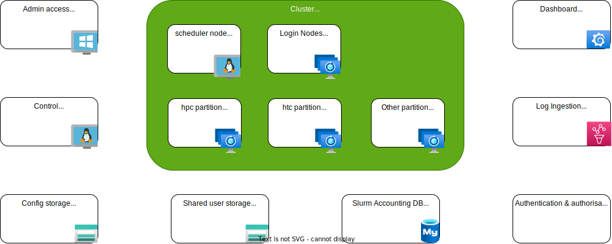

Use at your own risk responsibility etc.  For POC purposes only, designed for functionality, not security.  Im not giving support, nor does my employer.
# Architecture overview


# Pre deployment tasks:
- Download everything in this repo to a local folder.
- Make sure to have powershell and az cli installed.
- Review the CycleCloudParameters.json file and adjust the settings to your needs.  Make sure change the default password for the CycleCloud user.
- Have onwer rights on the Azure subscription you are gooing to deploy to.


# Deployment tasks:
- Log in into Azure using Azure cli
- Open a powershell window and navigate to the folder where you downloaded the files.
- Execute the deploy.ps1 script


# Post deployment tasks:
Log on to the management windows 11 workstation and run the following command:
```
ssh-keygen
type .\.ssh\id_rsa.pub
```
copy the public key, and enter it when asked during the first deploy of CycleCloud.


Log on to the CycleCloud server using Bastion and run the following command:
```bash 
cyclecloud initialize
```

This command will create a .cycle folder with the config.ini file in the CycleCloud user's home directory.  From this point you can work with the CLI and the API on the CycleCloud server.

Open a browser and go to the CycleCloud server's IP address using http, enter the base information, including the public key just created.

# Create a Slurm cluster

## About
- Give the thing a name

## Required settings
- Select a region, us the same as teh region where you deployed CycleCloud
- Select your VM types
- Set core limits
- Select a network that is big enough to hold the VMs

## Network attached storage
- for now leave default

## Advanced settings
### Software
- Select the OS, and the version (leave default for now)

### Advanced Networking
- remove the box from use Public Head Node

## Security
leave all default

## Cloud-init
- Disable apply to all, the individual node types can now have their own cloud-init settings
- Paste the content from the corresponding file in each cloud-init field
  - scheduler: CycleCloudSlurmClusterSheduler.yaml
  - hpc: CycleCloudSlurmClusterHPC.yaml

# Test the cluster
- From the management workstation, log on to the scheduler node using ssh
- In the folder /slurm/experiment01/ you will find a script called slurmtest02.sh
- Edit the script so it has the parameters you want (optional)  
- Run the script, it should create HPC nodes & start a job on the cluster

